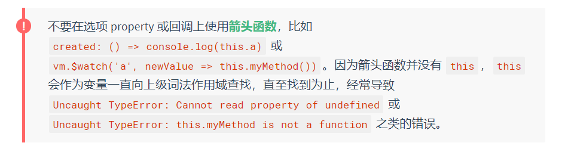
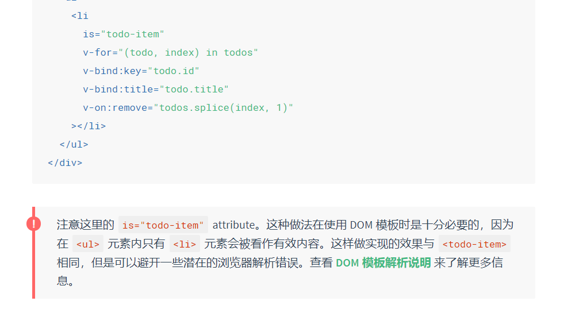

# 1. 什么是响应式

当一个 Vue 实例被创建时，它将 `data` 对象中的所有的 property 加入到 Vue 的**响应式系统**中。当这些 property 的值发生改变时，视图将会产生“响应”，即匹配更新为新的值。

- 只有当实例被创建时就已经存在于 `data` 中的 property 才是**响应式**的。(后来添加的属性不是响应的！)
- 这里唯一的例外是使用 `Object.freeze()`，这会阻止修改现有的 property，也意味着响应系统无法再*追踪*变化。

# 2. 什么是生命周期钩子

每个 Vue 实例在被创建时都要经过**一系列的初始化过程**——例如，需要设置数据监听、编译模板、将实例挂载到 DOM 并在数据变化时更新 DOM 等。同时在这个**过程中**也会运行一些叫做**生命周期钩子**的函数，这给了用户在不同阶段添加自己的代码的机会。

- 生命周期钩子的 **`this`** 上下文指向调用它的 Vue 实例。



- 

- beforeCreate -> created ->  beforeMount - > mounted -> beforeUpdate -> updated -> beforeDestory -> destoryed

# 3. Vue使用模版语法

Vue.js 使用了**基于 HTML 的模板语法**，允许开发者声明式地将 DOM 绑定至底层 Vue 实例的数据。所有 Vue.js 的模板**都是合法的 HTML**，所以能被遵循规范的浏览器和 HTML 解析器解析。

在底层的实现上，**Vue 将模板编译成虚拟 DOM 渲染函数**。结合响应系统，Vue 能够智能地计算出最少需要重新渲染多少组件，并把 DOM 操作次数减到最少。

# 4. 什么是动态参数（2.6.0+新增）

从 2.6.0 开始，可以用方括号括起来的 JavaScript 表达式作为一个指令的参数：

```HTML
<!-- 注意，参数表达式的写法存在一些约束，如之后的“对动态参数表达式的约束”章节所述。 -->

 <a v-bind:[attributeName]="url"> ... </a>
```

- 动态参数值的约束：字符串，异常情况应为null (可用于显性移除绑定)

- 表达式的约束：用没有空格或引号的表达式，或用计算属性替代这种复杂表达式

- 避免使用大写字符来命名键名，因为浏览器会把 attribute 名全部强制转为小写

```HTML
  <div id="app">
      <div><a v-model:[href]="url">这是一个链接</a></div>
  

      <div><a v-on:[things]="doSomething">事件</a></div>
  </div>
  <script>
      var vm = new Vue({
          el: '#app',
          data: {
              href: 'href',
              things: 'mouseover',
              url: 'baidu.com',
              contents: 'doSomething'
          },
          methods: {
              doSomething: function () {
                  alert('已被触发！')
              }
          }
      })
  </script>
```

# 5. 修饰符

修饰符 (modifier) 是以半角句号 `.` 指明的特殊后缀，用于指出一个指令应该以特殊方式绑定。例如，`.prevent` 修饰符告诉 `v-on` 指令对于触发的事件调用 `event.preventDefault()`：

```
<form v-on:submit.prevent="onSubmit">...</form>
```

# 6. 为什么要用计算属性

- 为什么不用函数

  计算属性是基于它们的响应式依赖进行**缓存的**。只在相关响应式依赖发生改变时它们才会重新求值。这就意味着只要 `message` 还没有发生改变，多次访问 `reversedMessage` 计算属性会立即返回之前的计算结果，而不必再次执行函数。

- 为什么不用侦听属性

   当你有一些数据需要随着其它数据变动而变动时，你很容易滥用 `watch`，造成重复冗余的代码

- getter / setter

# 7. 什么时候用侦听

当需要在数据变化时**执行异步或开销较大的操作**时，这个方式是最有用的。

# 8. 绑定类型和样式

- 对象语法

  ```html
  <div
    class="static"
    v-bind:class="{ active: isActive, 'text-danger': hasError }"
  ></div>
  ```

  ```javascript
  data: {
    isActive: true,
    hasError: false
  }
  ```

- 数组语法

  ```Html
  <div v-bind:class="[activeClass, errorClass]"></div>
  ```

  ```js
  data: {
    activeClass: 'active',
    errorClass: 'text-danger'
  }
  ```

- 当 v-bind:style 使用需要添加浏览器引擎前缀的 CSS property 时，如 transform，Vue.js 会自动侦测并添加相应的前缀。

# 9. 利用key管理可复用元素

```html
<template v-if="loginType === 'username'">
  <label>Username</label>
  <input placeholder="Enter your username" key="username-input">
</template>
<template v-else>
  <label>Email</label>
  <input placeholder="Enter your email address" key="email-input">
</template>
```

- 不使用key，则两个input不会发生替换，切换时只会改变placeholder
- 使用key，即可使两个元素完全独立

# 10. v-show和v-if 区别

- show 是完全渲染在DOM中的，仅改变display
- if 是**惰性的**：如果在初始渲染时条件为假，则什么也不做——直到条件第一次变为真时，才会开始渲染条件块。

# 11. 为什么 v-for 要提供 key

- 就地更新

  当 Vue 正在更新使用 `v-for` 渲染的元素列表时，它默认使用“就地更新”的策略。如果数据项的顺序被改变，Vue 将不会移动 DOM 元素来匹配数据项的顺序，而是就地更新每个元素，并且确保它们在每个索引位置正确渲染。

- 为了给 Vue 一个提示，以便它能跟踪每个节点的身份，从而重用和重新排序现有元素，你需要为每项提供一个唯一 `key` attribute

- 因为它是 Vue 识别节点的一个通用机制，`key` 并不仅与 `v-for` 特别关联。后面我们将在指南中看到，它还具有其它用途。

# 12. 为什么要用 is 语法



# 13. 什么是事件修饰符

- `.stop`
- `.prevent`
- `.capture`
- `.self`
- `.once`
- `.passive`

```html
<!-- 阻止单击事件继续传播 -->
<a v-on:click.stop="doThis"></a>

<!-- 提交事件不再重载页面 -->
<form v-on:submit.prevent="onSubmit"></form>

<!-- 修饰符可以串联 -->
<a v-on:click.stop.prevent="doThat"></a>

<!-- 只有修饰符 -->
<form v-on:submit.prevent></form>

<!-- 添加事件监听器时使用事件捕获模式 -->
<!-- 即内部元素触发的事件先在此处理，然后才交由内部元素进行处理 -->
<div v-on:click.capture="doThis">...</div>

<!-- 只当在 event.target 是当前元素自身时触发处理函数 -->
<!-- 即事件不是从内部元素触发的 -->
<div v-on:click.self="doThat">...</div>

<!-- 点击事件将只会触发一次 -->
<a v-on:click.once="doThis"></a>

<!-- 滚动事件的默认行为 (即滚动行为) 将会立即触发 -->
<!-- 而不会等待 `onScroll` 完成  -->
<!-- 这其中包含 `event.preventDefault()` 的情况 -->
<div v-on:scroll.passive="onScroll">...</div>
```

- 按键修饰符
  - 按键码
- 系统修饰键（alt clt...)
  - .exact 修饰符
  -  鼠标修饰符

# 14. 为什么用 v-on 

你可能注意到这种事件监听的方式违背了关注点分离 (separation of concern) 这个长期以来的优良传统。但不必担心，因为所有的 Vue.js 事件处理方法和表达式都严格绑定在当前视图的 ViewModel 上，它不会导致任何维护上的困难。实际上，使用 `v-on` 有几个好处：

1. 扫一眼 HTML 模板便能轻松定位在 JavaScript 代码里对应的方法。
2. 因为你无须在 JavaScript 里手动绑定事件，你的 ViewModel 代码可以是非常纯粹的逻辑，和 DOM 完全解耦，更易于测试。
3. 当一个 ViewModel 被销毁时，所有的事件处理器都会自动被删除。你无须担心如何清理它们。

# 15. v-model用在哪

`v-model` 在内部为不同的输入元素使用不同的 property 并抛出不同的事件：

- text 和 textarea 元素使用 `value` property 和 `input` 事件；
- checkbox 和 radio 使用 `checked` property 和 `change` 事件；
- select 字段将 `value` 作为 prop 并将 `change` 作为事件。

# 16. V-model 修饰符有哪些

- .lazy

  在默认情况下，`v-model` 在每次 `input` 事件触发后将输入框的值与数据进行同步 (除了[上述](https://cn.vuejs.org/v2/guide/forms.html#vmodel-ime-tip)输入法组合文字时)。你可以添加 `lazy` 修饰符，从而转为在 `change` 事件_之后_进行同步

  ```html
  <!-- 在“change”时而非“input”时更新 -->
  <input v-model.lazy="msg">
  ```

- .number

  如果想自动将用户的输入值转为数值类型，可以给 `v-model` 添加 `number` 修饰符

- .trim

  如果要自动过滤用户输入的首尾空白字符，可以给 `v-model` 添加 `trim` 修饰符

# 17. 父子组件如何传值

- 父组件 -> 子组件 ：prop:['attr1',...]

- 子组件 -> 父组件：父组件使用v-on进行监听，子组件使用$emit触发并传值

# 18. 动态组件如何实现

可以通过 Vue 的 `<component>` 元素加一个特殊的 `is` attribute 来实现

```html
<!-- 组件会在 `currentTabComponent` 改变时改变 -->
<component v-bind:is="currentTabComponent"></component>
```

# 19. MVC/MVP/MVVM

- MVC：
  - model：负责数据业务、模型、处理等功能
  - view：负责视图显示
  - controller：纽带，负责响应，调用model相关功能，再通知view更新

- MVP：MVC的改良，解耦model和view，完全分离model和view
  - presenter：中间人，处理从view到model和model到view的各种数据，对model和view进行同步
  - view和model大致不变

- MVVM
  - viewModel：思路与mvp一致，但vm实行双向绑定，view和model同步自动化

# 20. Vue双向绑定的原理

- vue 的双向数据绑定主要是通过使用数据劫持和发布订阅者模式来实现的。
- 首先我们通过 Object.defineProperty() 方法来对 Model 数据各个**属性添加访问器属性**，以此来实现数据的劫持，因此当 Model 中的数据发生变化的时候，我们可以**通过配置的 setter 和 getter 方法来实现对 View 层数据更新的通知**。
- 数据在 html 模板中一共有两种绑定情况，一种是使用 v-model 来对 value 值进行绑定，一种是作为文本绑定，
- 在对模板引擎进行解析的过程中：
  - 如果遇到元素节点，并且属性值包含 v-model 的话，我们就从 Model 中去获取 v-model 所对应的属性的值，并赋值给元素的 value 值。然后给这个元素设置一个监听事件，当 View 中元素的数据发生变化的时候触发该事件，通知 Model 中的对应的属性的值进行更新。
  - 如果遇到了绑定的文本节点，我们使用 Model 中对应的属性的值来替换这个文本。对于文本节点的更新，我们使用了发布订阅者模式，属性作为一个主题，我们为这个节点设置一个订阅者对象，将这个订阅者对象加入这个属性主题的订阅者列表中。当 Model 层数据发生改变的时候，Model 作为发布者向主题发出通知，主题收到通知再向它的所有订阅者推送，订阅者收到通知后更改自己的数据。

# 21. 使用Object.defineProperty缺点

- 有一些对属性的操作，使用这种方法无法拦截，比如说通过下标方式修改数组数据或者给对象新增属性，vue 内部通过重写函数解决了这个问题。
- 在 Vue3.0 中已经不使用这种方式了，而是通过使用 Proxy 对对象进行代理，从而实现数据劫持。使用 Proxy 的好处是它可以完美的监听到任何方式的数据改变，唯一的缺点是兼容性的问题，因为这是 ES6 的语法。