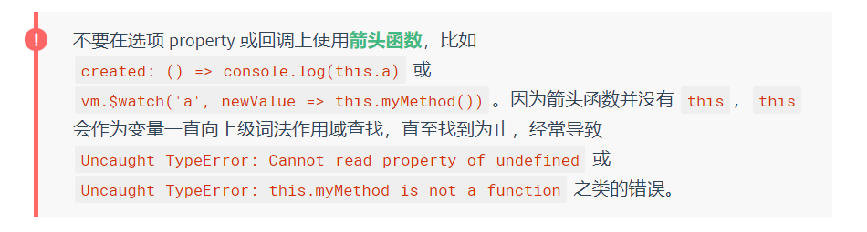

# 1. 什么是响应式

当一个 Vue 实例被创建时，它将 `data` 对象中的所有的 property 加入到 Vue 的**响应式系统**中。当这些 property 的值发生改变时，视图将会产生“响应”，即匹配更新为新的值。

- 只有当实例被创建时就已经存在于 `data` 中的 property 才是**响应式**的。(后来添加的属性不是响应的！)
- 这里唯一的例外是使用 `Object.freeze()`，这会阻止修改现有的 property，也意味着响应系统无法再*追踪*变化。

# 2. 什么是生命周期钩子

每个 Vue 实例在被创建时都要经过**一系列的初始化过程**——例如，需要设置数据监听、编译模板、将实例挂载到 DOM 并在数据变化时更新 DOM 等。同时在这个**过程中**也会运行一些叫做**生命周期钩子**的函数，这给了用户在不同阶段添加自己的代码的机会。

- 生命周期钩子的 **`this`** 上下文指向调用它的 Vue 实例。



- 

- beforeCreate -> created ->  beforeMount - > mounted -> beforeUpdate -> updated -> beforeDestory -> destoryed

# 3. Vue使用模版语法

Vue.js 使用了**基于 HTML 的模板语法**，允许开发者声明式地将 DOM 绑定至底层 Vue 实例的数据。所有 Vue.js 的模板**都是合法的 HTML**，所以能被遵循规范的浏览器和 HTML 解析器解析。

在底层的实现上，**Vue 将模板编译成虚拟 DOM 渲染函数**。结合响应系统，Vue 能够智能地计算出最少需要重新渲染多少组件，并把 DOM 操作次数减到最少。

# 4. 什么是动态参数（2.6.0+新增）

从 2.6.0 开始，可以用方括号括起来的 JavaScript 表达式作为一个指令的参数：

```HTML
<!-- 注意，参数表达式的写法存在一些约束，如之后的“对动态参数表达式的约束”章节所述。 -->

 <a v-bind:[attributeName]="url"> ... </a>
```

- 动态参数值的约束：字符串，异常情况应为null (可用于显性移除绑定)

- 表达式的约束：用没有空格或引号的表达式，或用计算属性替代这种复杂表达式

- 避免使用大写字符来命名键名，因为浏览器会把 attribute 名全部强制转为小写

```HTML
  <div id="app">
      <div><a v-model:[href]="url">这是一个链接</a></div>
  

      <div><a v-on:[things]="doSomething">事件</a></div>
  </div>
  <script>
      var vm = new Vue({
          el: '#app',
          data: {
              href: 'href',
              things: 'mouseover',
              url: 'baidu.com',
              contents: 'doSomething'
          },
          methods: {
              doSomething: function () {
                  alert('已被触发！')
              }
          }
      })
  </script>
```

# 5. 修饰符

修饰符 (modifier) 是以半角句号 `.` 指明的特殊后缀，用于指出一个指令应该以特殊方式绑定。例如，`.prevent` 修饰符告诉 `v-on` 指令对于触发的事件调用 `event.preventDefault()`：

```
<form v-on:submit.prevent="onSubmit">...</form>
```

# 6. 为什么要用计算属性

**计算属性是基于它们的响应式依赖进行缓存的**。只在相关响应式依赖发生改变时它们才会重新求值。这就意味着只要 `message` 还没有发生改变，多次访问 `reversedMessage` 计算属性会立即返回之前的计算结果，而不必再次执行函数。