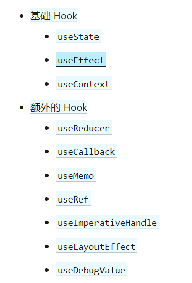
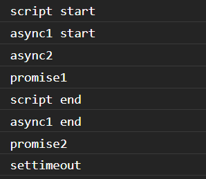
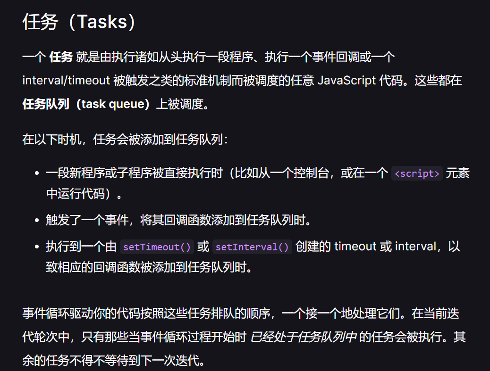
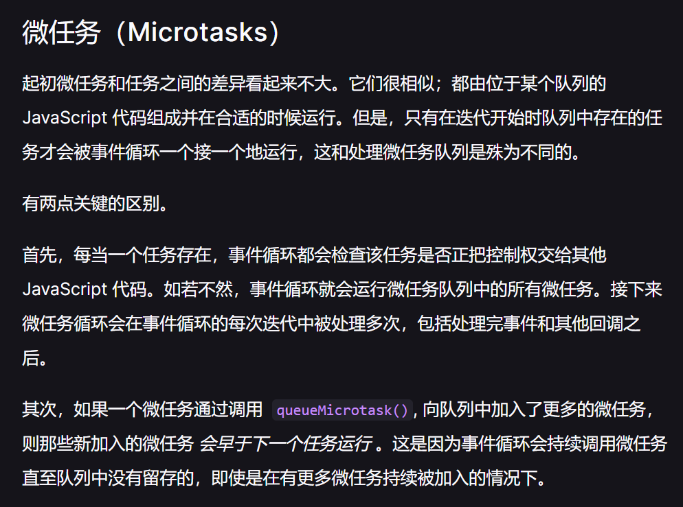

# 一些面经知识点

## React部分

### 1. 虚拟DOM

- 把页面DOM抽象成了JS对象，**抽象具体渲染过程，实现组件高度抽象化和跨平台**，使其不仅仅局限于浏览器
- 将多次DOM操作先反应在虚拟DOM上，再一次性更新到具体DOM，**在一程度上提高效率**

- 在牺牲部分性能前提下，增加可维护性
- 多一层对虚拟DOM操作，实际上会比原生操作更慢（时间上缺陷
- 需要在内存中维护，占用更多内存（空间上缺陷

### 2. Diff 算法

- 更新流程：
  - 调用render() 产生新的树
  - 与上一次的树进行比较，形成patch
  - 根据patch更新真实DOM
- 比较过程（启发式算法，完全比较需要 O(n^3)：
  - 原则：只发生最小的变化
  - 一：只对树的同一层次节点进行比较，忽略跨级
  - 二：对比根节点类型，不相同，则触发全部重建
  - 三：相同类型节点，对比 class （style 变化时，仅更新有变化的
  - 四：遍历子节点并递归（列表头结点插入会影响性能

### 3. 为什么需要key

- 如上所讲，列表头结点插入会影响性能
- 遍历子节点时，有大量相同类型节点会优先比较key，提高效率

### 4. React Hooks 有哪些



- useReducer:

```javascript
    const [state, dispatch] = useReducer(reducer, initialArg, init);
```

```javascript
    const initialState = {count: 0};
    
    function reducer(state, action) {
      switch (action.type) {
        case 'increment':
          return {count: state.count + 1};
        case 'decrement':
          return {count: state.count - 1};
        default:
          throw new Error();
      }
    }
    
    function Counter() {
      const [state, dispatch] = useReducer(reducer, initialState);
      return (
        <>
          Count: {state.count}
          <button onClick={() => dispatch({type: 'decrement'})}>-</button>
          <button onClick={() => dispatch({type: 'increment'})}>+</button>
        </>
      );
    }
```

- useCallback

  - [useCallback()、useMemo() 解决了什么问题？ - 简书 (jianshu.com)](https://www.jianshu.com/p/014ee0ebe959)

  - ```javascript
    const memoizedCallback = useCallback(
      () => {
        doSomething(a, b);
      },
      [a, b],
    );
    ```

  - useCallback(fn, deps) 相当于 useMemo(() => fn, deps)

  - 使用场景：

 ```javascript
      ()=>{} === ()=>{} // false
 ```

    - 父组件向子组件传入函数
    
    - 父组件重新渲染时会重新创建函数，导致子组件重新渲染

 ```javascript
      function ParentComp () {
        const [ count, setCount ] = useState(0)
        const increment = () => setCount(count + 1)
      
        const [ name, setName ] = useState('hi~')
        const changeName = (newName) => setName(newName)  // 父组件渲染时会创建一个新的函数
      
        return (
          <div>
            <button onClick={increment}>点击次数：{count}</button>
            <ChildComp name={name} onClick={changeName}/>
          </div>
        );
      }
 ```

- useMemo:

```javascript
    function ParentComp () {
      const [ count, setCount ] = useState(0)
      const increment = () => setCount(count + 1)
    
      const [ name, setName ] = useState('hi~')
      const changeName = (newName) => setName(newName)  // 父组件渲染时会创建一个新的函数
    
      return (
        <div>
          <button onClick={increment}>点击次数：{count}</button>
          <ChildComp name={name} onClick={changeName}/>
        </div>
      );
    }
```

  - 第一个参数是个函数，返回的对象指向同一个引用，不会创建新对象；

  - 第二个参数是个数组，只有数组中的变量改变时，第一个参数的函数才会返回一个新的对象。

### 5. React.createElement 与React.cloneElement

```javascript
React.cloneElement(element, [props], [...children]);

React.createElement(type, [props], [...children]);
```

- 区别就是，一个使用已有的element创建，另一个使用类型创建

### 6. Router

- 两种
  - Hash：监听hashchange事件
  - H5 History：监听URL的自定义事件
  - 匹配到相应的组件后触发渲染
- \<Router />  /  \<Link> / \<Switch>
- useParams()、useLocation()、useHistory()

### 7. Hooks 优点

- 更好的共享状态
- 复杂组件更好理解

## CSS部分

### 盒模型

- content padding border margin
- box-sizing: content-box  width, height不包含padding和border
- box-sizing: border-box ---包含padding border

### 选择器

- id 
- 类
- 标签
- 子代
- 相邻子代
- 兄弟
- 相邻兄弟
- 属性
- 伪类
- 伪元素
- 通配符

### ::before :after

- 双冒号是伪元素，单冒号是伪类
- 伪类：一般是元素的特殊状态
- 伪元素：一般是某个元素的特殊位置，不存在与文档中，看起来像一个元素，所以是伪元素

### 可以继承的属性

- 字体系列
- 文字系列
- 列表属性
- 表格布局
- 光标
- 可见性

### 优先级计算

- 由高到低，四级，0,0,0,0
- 标签内最高
- ID次高
- class/属性/伪类第三
- 元素和伪元素第四
- 通配符 0,0,0,0
- !important 无视，直接最高

### 伪类LVHA

- 鼠标的各种状态

### 居中

- text-align 行内 inline-block
- margin: 0 auto block
- 定位：50% + 负margin值/ translate
- flex  align-items: center; justify-content: center

### display

- none
- inline
- inline-block
- block
- list-item
- table
- inherit

### position

- static
- relative
- absolute
- fixed
- inherit

### flex

- 两根轴
- align-item: 交叉轴如何对齐
- justify-content: 项目在主轴上的对齐方式

### base64

- 减少请求
- 造成体积增大
- 无法直接缓存
- 兼容性问题

### 上下margin合并

- 条件：常规文档流，同一个BFC，没有padding和border
- 兄弟合并：设置其中一个为BFC
- 父子合并：设置border或者padding，添加内联元素，父元素形成BFC

### BFC

- 块级格式化上下文
- 独立布局环境，不影响其他
- 创建：根元素，浮动，绝对定位，display: inline-block, flex, table-cell, overflow: 不为visible

### 清除浮动

- 浮动元素，不属于普通文档流，造成父盒子高度塌陷
- 伪元素，clear:both

### 如何检测transition结束

检测transitionend事件

### 如何防止图片加载抖动

给图片预留位置

overflow: hidden; width: 100%; height: 0; padding-bottom: 图片宽高比 %

## JavaScript部分

### 1. 作用域

- 动态作用域：JS 中this 指向问题类似动态作用域
- 词法作用域：JS 采用词法作用域，由变量写在哪里（被声明位置）确定其作用域（编译器分词阶段确定

### 2. 闭包

- 函数能够记住和访问当前词法作用域，当函数当前作用域之外执行，就形成了闭包

- 如果把访问当前词法作用域的函数当参数传递（回调函数）就是应用了闭包

```javascript
function wait(message) {
    setTimeout(function timer() {
		console.log(message);
    },1000);
}
```

### 3. this 指向问题

- 类似动态作用域

- new 绑定
- 显示绑定 (bind/apply/call)
- 隐式绑定(是否由上下文对象调用)
- 默认绑定(严格模式为undefined，其它情况为全局对象)
- 箭头函数，回归词法作用域

### 4. 硬绑定与软绑定

- 硬绑定(bind/apply)

```javascript
// 实现一个bind
Function.prototype.myBind = function (othis, ...rest) {
  if (typeof this !== 'function') {
    throw new TypeError('not callable');
  }
  const ftoBind = this,
    fNOP = function () {},
    fBound = function (...args) {
        // 判断new 调用
      return ftoBind.apply(this.constructor === ftoBind ? this : othis, rest.concat(args));
    };
   // 连接原型
  // fNOP.prototype = this.prototype;
  // fBound.prototype = new fNOP();
    fbound.prototype = Object.create(this.prototype)
  return fBound;
};
```

- 软绑定（硬绑定无法修改this ,软绑定可以修改

```javascript
Function.prototype.softbind = function (obj, ...rest) {
  const fn = this;
  const bound = function (...args) {
    // 保留隐式绑定和显示绑定的能力
    return fn.apply(!this || this === (window || global) ? obj : this, rest.concat(args));
  };
    // 构造原型链
  bound.prototype = Object.create(fn.prototype);
};
```

### 5. `['1', '2', '3'].map(parseInt)` what & why ?

- **parseInt(\*string\*, \*radix\*)**  解析一个字符串并返回指定基数的十进制整数， `radix` 是2-36之间的整数，表示被解析字符串的基数。

```javascript
var new_array = arr.map(function callback(currentValue[, index[, array]]) {
 // Return element for new_array 
}[, thisArg])
```

- parseInt('1', 0) //radix为0时，且string参数不以“0x”和“0”开头时，按照10为基数处理。这个时候返回1
- parseInt('2', 1) //基数为1（1进制）表示的数中，最大值小于2，所以无法解析，返回NaN
- parseInt('3', 2) //基数为2（2进制）表示的数中，最大值小于3，所以无法解析，返回NaN

### 6. 深拷贝

```javascript
function deepClone(obj, depth = Infinity, objStack = []) {
  function getKeyVals(obj) {
    // 获取包括Symbol在内的所有属性
    return [...Object.keys(obj), ...Object.getOwnPropertySymbols(obj)].map((key) => [
      key,
      obj[key]
    ]);
  }

  if (depth <= 0 || objStack.includes(obj)) {
    // 处理循环引用
    return null;
  }

  if (obj instanceof Date) {
    // 处理时间
    return new Date(obj);
  }
  if (Array.isArray(obj)) {
    // 处理数组
    return obj.map((o) =>
      typeof o === 'object' ? deepClone(o, depth - 1, objStack.concat([obj])) : o
    );
  }
  // 快速浅克隆
  const ret = Object.assign({}, obj);
  getKeyVals(ret).forEach(([key, val]) => {
    // 处理需要深克隆的情况
    if (typeof key === 'object') {
      ret[key] = deepClone(val, depth - 1, objStack.concat([obj]));
    }
  });
}
```

### 7. 数据类型

- 基本类型：Number / Boolean / String / Null / Undefined / BigInt / Symbol，存放在栈中
- 复杂类型：Object 存放在堆中

### 8. 异步

- 概念：事件循环、宏任务、微任务 / Promise 、生成器、setTimeout
- [在 JavaScript 中通过 queueMicrotask() 使用微任务 - Web API 接口参考 | MDN (mozilla.org)](https://developer.mozilla.org/zh-CN/docs/Web/API/HTML_DOM_API/Microtask_guide)

```javascript
async function async1() {
  console.log('async1 start'); // 2
  await async2();
  console.log('async1 end');// 6
}
async function async2() {
  console.log('async2'); // 3
}
console.log('script start'); // 1
setTimeout(function () {
  console.log('settimeout'); // 8
});
async1(); 
new Promise(function (resolve) {
  console.log('promise1'); // 4
  resolve();
}).then(function () {
  console.log('promise2'); // 7
});
console.log('script end'); // 5

```







### 9. 数组扁平化

```javascript
function flat(arr) {
  const lst = [];
  if (Array.isArray(arr)) {
    arr.forEach((item) => {
      if (Array.isArray(item)) {
        const tmp = flat(item);
        lst.push(...tmp);
      } else {
        lst.push(item);
      }
    });
  }
  return lst;
}

// 自带方法
Array.prototype.flat()
Array.prototype.flatMap()
```

### 10. JWT JSON Web Token

三个部分组成：1. header 2. payload 3. signature

如何编码：Base64(header) . Base64(payload) . 加密算法(base64(header)+‘.’+base64(payload), secret)

如何验证：在服务的对token中的header 和 payload重新加密，比对签名

如何防止篡改：secret只保存在服务端，如果发生篡改，对header payload加密后，比对会失败

payload中的内容：签发者、面向的用户、过期时间、签发时间、jwt id等还可以加一些业务逻辑相关内容。

### 11. 跨域

- 同源策略：协议、域名、端口号一致，不同源的js脚本不能操作数据

### 12. decodeURI() decodeURIComponent()

encodeURI()主要用于整个URI(例如，[http://www.baidu.com/search](https://link.zhihu.com/?target=http%3A//www.baidu.com/search)  value.html)，而encode-URIComponent()主要用于对URI中的某一段(例如前面URI中的search value.html)进行编码。它们的主要区别在于，**encodeURI()不会对本身属于URI的特殊字符进行编码，例如冒号:、正斜杠/、问号?和井号#**；**而encodeURIComponent()则会对它发现的任何非标准字符进行编码**。

## HTML部分

### 1. meta

```html
<!-- 声明文档使用的字符编码 -->
<meta charset='utf-8'>

<!-- 优先使用 IE 最新版本和 Chrome -->
<meta http-equiv="X-UA-Compatible" content="IE=edge,chrome=1"/>

<!-- 页面描述 -->
<meta name="description" content="不超过150个字符"/>

<!-- 页面关键词 -->
<meta name="keywords" content=""/>

<!-- 网页作者 -->
<meta name="author" content="name, email@gmail.com"/>


<!-- 为移动设备添加 viewport -->
<meta name="viewport" content="initial-scale=1, maximum-scale=3, minimum-scale=1, user-scalable=no">
<!-- `width=device-width` 会导致 iPhone 5 添加到主屏后以 WebApp 全屏模式打开页面时出现黑边 http://bigc.at/ios-webapp-viewport-meta.orz -->


<!-- iOS 设备 begin -->

<meta name="apple-mobile-web-app-title" content="标题">
<!-- 添加到主屏后的标题（iOS 6 新增） -->

<meta name="apple-mobile-web-app-capable" content="yes"/>
<!-- 是否启用 WebApp 全屏模式，删除苹果默认的工具栏和菜单栏 -->

<meta name="apple-itunes-app" content="app-id=myAppStoreID, affiliate-data=myAffiliateData, app-argument=myURL">
<!-- 添加智能 App 广告条 Smart App Banner（iOS 6+ Safari） -->

<meta name="apple-mobile-web-app-status-bar-style" content="black"/>
<!-- 设置苹果工具栏颜色 -->

<meta name="format-detection" content="telphone=no, email=no"/>
<!-- 忽略页面中的数字识别为电话，忽略email识别 -->

<!-- 启用360浏览器的极速模式(webkit) -->
<meta name="renderer" content="webkit">

<!-- 避免IE使用兼容模式 -->
<meta http-equiv="X-UA-Compatible" content="IE=edge">

<!-- 不让百度转码 -->
<meta http-equiv="Cache-Control" content="no-siteapp" />

<!-- 针对手持设备优化，主要是针对一些老的不识别viewport的浏览器，比如黑莓 -->
<meta name="HandheldFriendly" content="true">

<!-- 微软的老式浏览器 -->
<meta name="MobileOptimized" content="320">

<!-- uc强制竖屏 -->
<meta name="screen-orientation" content="portrait">

<!-- QQ强制竖屏 -->
<meta name="x5-orientation" content="portrait">

<!-- UC强制全屏 -->
<meta name="full-screen" content="yes">

<!-- QQ强制全屏 -->
<meta name="x5-fullscreen" content="true">

<!-- UC应用模式 -->
<meta name="browsermode" content="application">

<!-- QQ应用模式 -->
<meta name="x5-page-mode" content="app">

<!-- windows phone 点击无高光 -->
<meta name="msapplication-tap-highlight" content="no">


<!-- iOS 图标 begin -->

<link rel="apple-touch-icon-precomposed" href="/apple-touch-icon-57x57-precomposed.png"/>
<!-- iPhone 和 iTouch，默认 57x57 像素，必须有 -->

<link rel="apple-touch-icon-precomposed" sizes="114x114" href="/apple-touch-icon-114x114-precomposed.png"/>
<!-- Retina iPhone 和 Retina iTouch，114x114 像素，可以没有，但推荐有 -->

<link rel="apple-touch-icon-precomposed" sizes="144x144" href="/apple-touch-icon-144x144-precomposed.png"/>
<!-- Retina iPad，144x144 像素，可以没有，但推荐有 -->
<!-- iOS 图标 end -->


<!-- iOS 启动画面 begin -->

<link rel="apple-touch-startup-image" sizes="768x1004" href="/splash-screen-768x1004.png"/>
<!-- iPad 竖屏 768 x 1004（标准分辨率） -->

<link rel="apple-touch-startup-image" sizes="1536x2008" href="/splash-screen-1536x2008.png"/>
<!-- iPad 竖屏 1536x2008（Retina） -->

<link rel="apple-touch-startup-image" sizes="1024x748" href="/Default-Portrait-1024x748.png"/>
<!-- iPad 横屏 1024x748（标准分辨率） -->

<link rel="apple-touch-startup-image" sizes="2048x1496" href="/splash-screen-2048x1496.png"/>
<!-- iPad 横屏 2048x1496（Retina） -->

<link rel="apple-touch-startup-image" href="/splash-screen-320x480.png"/>
<!-- iPhone/iPod Touch 竖屏 320x480 (标准分辨率) -->

<link rel="apple-touch-startup-image" sizes="640x960" href="/splash-screen-640x960.png"/>
<!-- iPhone/iPod Touch 竖屏 640x960 (Retina) -->

<link rel="apple-touch-startup-image" sizes="640x1136" href="/splash-screen-640x1136.png"/>
<!-- iPhone 5/iPod Touch 5 竖屏 640x1136 (Retina) -->

<!-- iOS 启动画面 end -->

<!-- iOS 设备 end -->

<meta name="msapplication-TileColor" content="#000"/>
<!-- Windows 8 磁贴颜色 -->

<meta name="msapplication-TileImage" content="icon.png"/>
<!-- Windows 8 磁贴图标 -->

<link rel="alternate" type="application/rss+xml" title="RSS" href="/rss.xml"/>
<!-- 添加 RSS 订阅 -->

<link rel="shortcut icon" type="image/ico" href="/favicon.ico"/>
<!-- 添加 favicon icon -->

<!-- sns 社交标签 begin -->
<!-- 参考微博API -->
<meta property="og:type" content="类型" />
<meta property="og:url" content="URL地址" />
<meta property="og:title" content="标题" />
<meta property="og:image" content="图片" />
<meta property="og:description" content="描述" />
<!-- sns 社交标签 end -->
<!-- 搜索引擎抓取 -->
<meta name="robots" content="index,follow"/>

具体参数如下：

信息参数为all：文件将被检索，且页面上的链接可以被查询；

信息参数为none：文件将不被检索，且页面上的链接不可以被查询；

信息参数为index：文件将被检索；

信息参数为follow：页面上的链接可以被查询；

信息参数为noindex：文件将不被检索，但页面上的链接可以被查询；

信息参数为nofollow：文件将被检索，但页面上的链接不可以被查询；
```

### 2. [很全很全的前端本地存储讲解 - SegmentFault 思否](https://segmentfault.com/a/1190000012578794#articleHeader0)

### 3. [WebSocket协议：5分钟从入门到精通 - 程序猿小卡 - 博客园 (cnblogs.com)](https://www.cnblogs.com/chyingp/p/websocket-deep-in.html)

## 浏览器部分

### 1. 性能优化：

- 减少HTTP请求次数：文件合并、雪碧图、base64、img不要有空src等、使用GET
- 缓存：DNS缓存、HTML缓存
- 服务端：CDN、Gzip压缩、减小cookie

### 2. 浏览器缓存

缓存分为私有缓存和共享缓存，浏览器缓存一般为私有缓存。

缓存关键主要是 Method 和 URI。

常见按理：(1) GET + 200 (2) 永久重定向 301 (3) 404 (4) 206 不完全响应 (5) 被定义为cache键名的响应

强缓存还是协商缓存由响应头的设置决定。

- 强缓存：请求时，先获取缓存的响应头，根据cache-control 信息，判断是否命中缓存，命中则为强缓存(max-age)
- 协商缓存：未命中或者 no-cache就是协商缓存，顾名思义需要与服务器协商是否使用缓存。
- Last-modified : 协商缓存中使用，帮助服务器了解缓存是否够新，后续请求发送时，会在请求头中添加 if-modified-since 字段判断资源是否变化，未变化则返回304 NOT MODIFIED，变化则返回请求中更新last -modified字段，变化则返回 200
- E-TAG：与 last - modified类似，后续请求也会发送 if - none -match，判断文件是否变更
- 为什么有了 last-modified还要e-tag，因为
  - 某些文件可能会周期性更改，但并不修改文件内容
  - 某些文件会频繁修改，粒度小于秒这个last-modified的最小单位
  - 某些服务器不能精确得到最后修改时间
- no-cache : 不使用强缓存
- no - store：不使用缓存

## 信息安全部分

### 1. MD5

- MD5解密：对特别大的数据表，密文和密码明文对应，对比查表
- 如何加盐：每个用户随机生成一个盐值，每个盐值都不同。
